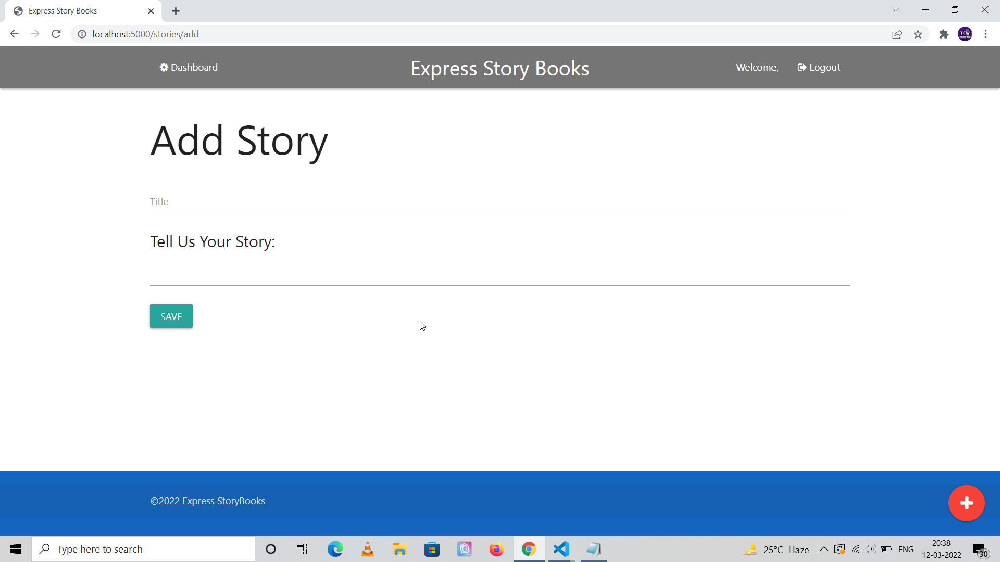

<h3 align="center">
  Express To Do with Google OAuth
</h3>

## App Features

- Login using your Google Credentials and then he/she should be able to create stories with title and body.

- Integrate with Github Oauth.

- Create a back-end login system which is separate from Google or Github credentials.

## Overview

The app is inspired from one of the Express apps which was built by Brad Traversy in one of his Node courses. It had only Google Auth in it with a CRUD model on stories. I've added Github login as well aside from the Google Login which original app had. Aside from this, it also has a local authentication system to register and login for those who do not wish to login using
their Google or Github accounts.

It uses short-term cookies for persistent session creation which would be done upon successful passport authentication through any of the allowed login methods. This Application is built in Express JS using MongoDB as the database provider, Mongoose package is used for ORM and materialize CSS is used for styling.

## Development Setup

Please install node modules through npm install command, contains separate front-end and back-end sections.

```
npm install

// For development
npm start

```

## Updates

- 12/3/2022 - Added local passport authentication with Google Auth, users can now register and login if they do not 
have a Google account.

- 13/3/2022 - Added github passport authentication which uses Github OAuth2 API.

## Project Screenshots

Screenshots would be added as development is in progress. Below is the welcome page of the application.


Add Story Page



List of stories for a logged in user displayed on the dashboard page.


## Estimated Completion Time

The project is expected to be completed in around 2 days.
